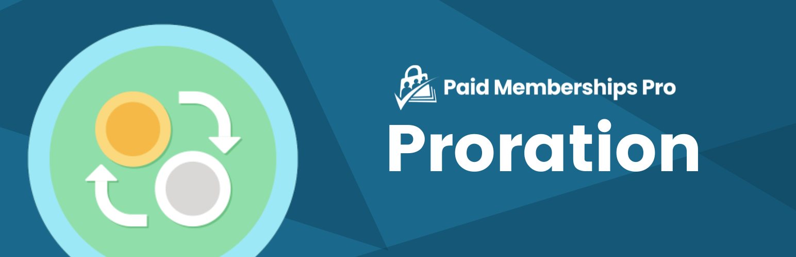

# [Paid Memberships Pro - Proration](https://www.paidmembershipspro.com/add-ons/proration-prorate-membership/) #

### Welcome to the Paid Memberships Pro - Proration GitHub Repository

This plugin offers simple proration for membership upgrades and downgrades to adjust initial payment at membership checkout and maintain a member's renewal payment date.

For more information please visit [paidmembershipspro.com/add-ons/pmpro-proration/](https://www.paidmembershipspro.com/add-ons/proration-prorate-membership/)

## Installation ##
For detailed installation steps, visit the [documentation](https://www.paidmembershipspro.com/add-ons/proration-prorate-membership/) page.

1. Download the current development ZIP file directly: `https://github.com/strangerstudios/pmpro-proration/archive/dev.zip`

**Please ensure that once installing this version of the plugin to remove `-dev` from the plugin's folder name.**

## Bugs ##
If you find an issue/bug, let us know by [creating a detailed GitHub issue](https://github.com/strangerstudios/pmpro-proration/issues/new).

## Support ##
This is a developer's portal for Paid Memberships Pro - Proration. We do not offer support on this channel. **Any support related questions should be directed to [paidmembershipspro.com/add-ons/pmpro-proration/](https://www.paidmembershipspro.com/add-ons/proration-prorate-membership/).**

## Contributing to Paid Memberships Pro - Proration ##
We encourage and welcome any contribution to Paid Memberships Pro - Proration. Please read the [guidelines for contributing](https://github.com/strangerstudios/paid-memberships-pro/blob/dev/.github/CONTRIBUTING.md) to this repository.

There are various **ways to the help development** of Paid Memberships Pro - Proration:

1. Report [bugs/issues](https://github.com/strangerstudios/pmpro-proration/issues/new) on GitHub.
2. Work on any issues by submitting a Pull Request.

Here are some ways for **non-developers to contribute** to Paid Memberships Pro - Proration:

1. Translate Paid Memberships Pro - Proration into your own [language](https://www.paidmembershipspro.com/paid-memberships-pro-in-your-language/).
2. [Purchase a paid membership](https://www.paidmembershipspro.com/pricing) to help fund ongoing development and bug fixes.
